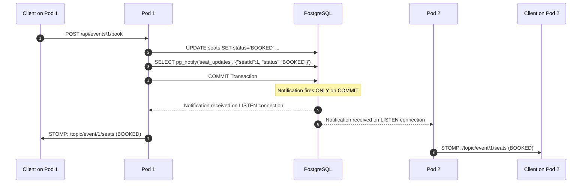
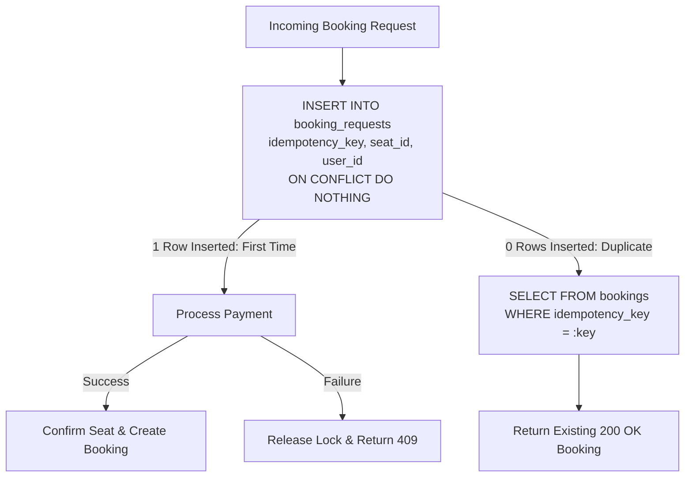

# SeatLock Architecture Deep Dive 📐

This document provides a comprehensive technical exploration of SeatLock's concurrency design, distributed synchronization, resilience mechanisms, and failure mitigation strategies.

---

## 1. Concurrency Control Mechanisms

### 1.1 Pessimistic Locking with `FOR UPDATE SKIP LOCKED`

```sql
SELECT * FROM seats 
WHERE id = :seatId AND status = 'AVAILABLE' 
FOR UPDATE SKIP LOCKED;
```

#### How It Operates:
1. **Row-Level Lock Acquisition**: When a transaction executes this statement, PostgreSQL attempts to acquire an exclusive row lock (`RowExclusiveLock`) on the target row in the `seats` table.
2. **Instant Non-Blocking Skip**: If another active transaction already holds an exclusive lock on that row:
   - Regular `FOR UPDATE` would cause the query to **block** until the first transaction commits or rolls back (causing thread pool exhaustion under high concurrency).
   - `FOR UPDATE NOWAIT` would immediately throw a serialization error (`ERROR: could not obtain lock on row in relation "seats"`).
   - `FOR UPDATE SKIP LOCKED` ignores locked rows and immediately returns an empty result set (`0 rows`).
3. **Application Reaction**: The Spring Boot backend observes `Optional.empty()` and immediately responds with HTTP 409 Conflict without consuming database or thread resources.

```mermaid
sequenceDiagram
    autonumber
    actor UserA as User A (Pod 1)
    actor UserB as User B (Pod 2)
    participant DB as PostgreSQL (seats table)

    UserA->>DB: BEGIN TX 1
    UserB->>DB: BEGIN TX 2
    UserA->>DB: SELECT * FROM seats WHERE id=1 AND status='AVAILABLE' FOR UPDATE SKIP LOCKED
    DB-->>UserA: Returns Row (Seat 1 - Locked)
    UserB->>DB: SELECT * FROM seats WHERE id=1 AND status='AVAILABLE' FOR UPDATE SKIP LOCKED
    DB-->>UserB: Returns 0 Rows (Skipped!)
    UserB->>UserB: Return HTTP 409 Conflict immediately (0ms wait)
    UserA->>DB: UPDATE seats SET status='BOOKED' ...; COMMIT
```

---

### 1.2 Optimistic Locking with `@Version`

```java
@Version
@Column(nullable = false)
private Integer version;
```

#### How It Operates:
1. When a transaction reads the seat row, Hibernate retrieves the current `version` (e.g., `version = 0`).
2. When modifying the seat to `LOCKED`, Hibernate executes:
   ```sql
   UPDATE seats 
   SET status = 'LOCKED', version = 1, locked_by = :userId, updated_at = now() 
   WHERE id = :seatId AND version = 0;
   ```
3. If another transaction updated the seat in the interim (`version` is already `1`), the `UPDATE` matches `0 rows`.
4. Spring Data / Hibernate throws `ObjectOptimisticLockingFailureException`.
5. The service catches the exception and gracefully returns an empty result.

#### Comparative Benchmark Analysis:

| Dimension | Pessimistic (`FOR UPDATE SKIP LOCKED`) | Optimistic (`@Version`) |
|---|---|---|
| **Lock Duration** | Holds lock throughout transaction | No locks held until commit |
| **High Contention Behavior** | Deterministic: first thread locks, others skip | All threads proceed, only first to flush succeeds |
| **Database Overhead** | Minimal row lock tracking | Minimal version comparison |
| **Throughput under Low Contention** | Slightly lower (~650 TPS) | Higher (~1400 TPS) |
| **Ideal Scenario** | "Flash Sale" where 500 users fight for 1 seat | General booking across large catalog |

---

## 2. Distributed Synchronization Without Redis

### 2.1 Cross-Pod WebSocket Fan-Out via `LISTEN` / `NOTIFY`

In a multi-pod Kubernetes deployment (3 replicas), WebSocket connections are stateful and pinned to individual pods. When Pod 1 confirms a booking or records an audit entry, Pods 2 and 3 must also notify their connected clients.



#### Implementation Highlights:
- **Transactional Guarantee**: `pg_notify` fires **strictly on transaction commit**. If the transaction rolls back, no notification is ever broadcasted.
- **Dedicated Unpooled Connection**: PostgreSQL `LISTEN` requires a persistent, long-lived TCP connection. HikariCP pool recycling would terminate the channel subscription. We use a dedicated `DriverManager.getConnection()` instance managed by Spring's `SmartLifecycle`.
- **Payload Discipline**: PostgreSQL payloads are capped at 8,000 bytes. SeatLock passes lightweight JSON event payloads containing IDs and status strings.

---

### 2.2 Distributed Scheduled Jobs via `pg_try_advisory_xact_lock`

```sql
SELECT pg_try_advisory_xact_lock(1001);
```

#### Why Not Redis Distributed Lock (Redlock)?
- **Split-Brain Immunity**: Redlock across Redis nodes is vulnerable to clock drift and GC pauses. PostgreSQL advisory locks are managed by the single ACID database engine.
- **Transaction Scope (`_xact_`)**: The lock automatically releases the moment the transaction commits or aborts—even if the JVM crashes or the pod is killed.
- **Non-Blocking (`try_`)**: Returns `true` if acquired, `false` immediately if another pod is already running the job.

---

## 3. Resilience, Rate Limiting & Tracing

### 3.1 In-Memory Rate Limiting (Bucket4j)
- **Token Bucket Algorithm**: 10 tokens per 10-second refill window per user (`seatlock_user_id` cookie or IP).
- **Target Endpoints**: Intercepts `POST /api/events/*/seats/*/lock` and `POST /api/events/*/book`.
- **HTTP 429 & Headers**: Returns HTTP 429 Too Many Requests with `Retry-After: 10`.
- **Design Trade-off**: Stored in-memory in `ConcurrentHashMap<UUID, Bucket>` without Redis overhead. In a round-robin cluster, user rate limits apply per-pod or via sticky session routing.

### 3.2 Circuit Breaking & Retries (Resilience4j)
- **Circuit Breaker on Payment Gateway**: Tracks payment failures over a sliding window of 10 calls. When failure rate exceeds 50%, transitions to `OPEN` state to prevent cascading payment service exhaustion.
- **Exponential Backoff Retries**: Up to 3 attempts with 100ms initial backoff and 2.0x multiplier on transient gateway timeouts.
- **Compensating Rollback**: On terminal payment failure, the seat lock is immediately released back to `AVAILABLE` and logged with actor `USER` and reason `Payment failed — seat released (compensation)`.

### 3.3 MDC Trace Correlation (`X-Correlation-Id`)
- Every HTTP request receives or inherits an `X-Correlation-Id` UUID header.
- Servlet filter `TraceIdFilter` populates SLF4J MDC `traceId`.
- Background asynchronous jobs (`LockReaperJob`, `WaitingRoomAdmissionJob`) establish discrete MDC execution scopes (`reaper-<uuid>`, `admission-<uuid>`).
- All error responses (`GlobalExceptionHandler`) return the correlation `traceId` for zero-friction debugging across multi-replica logs.

---

## 4. Idempotency Gate Architecture



- **Atomic SQL Gate**: Native PostgreSQL `INSERT INTO booking_requests (...) VALUES (...) ON CONFLICT (idempotency_key) DO NOTHING`.
- **Thread Safety**: 20 concurrent threads submitting identical idempotency keys simultaneously execute safely without corrupting the Hibernate session or duplicate bookings.

---

## 5. Observability: Prometheus, Grafana & Telemetry

### 5.1 Metrics Registration (Micrometer)
- **Actuator Endpoint**: `/actuator/prometheus` scraped every 5 seconds.
- **Custom Business Metrics**:
  - `seatlock_lock_contention_total` (Counter)
  - `seatlock_booking_latency_seconds` (Timer with p50, p95, p99 percentiles)
  - `seatlock_bookings_total` (Counter)
  - `seatlock_seats_available`, `seatlock_seats_locked`, `seatlock_seats_booked` (Gauges)

### 5.2 Admin Dashboard & 60-Point Ring Buffer
- **In-Memory Ring Buffer**: `MetricsHistoryService` retains the last 60 snapshot points (5s resolution) exposed at `GET /api/events/{eventId}/metrics-history`.
- **Live Audit Feed**: Streamed via WebSocket STOMP topic `/topic/event/{eventId}/audit-log` tagged with the serving replica's `podHostname`.

---

## 6. What Breaks at 10x Scale (50,000+ Users)?

| Component | Limit in Current Architecture | 10x Scale Evolution |
|---|---|---|
| **DB Connections** | Max connections hit during burst | Add **PgBouncer** connection pooler in transaction mode |
| **Cross-Pod Sync** | `pg_notify` payload capped at 8KB | Transition to **Apache Kafka** or **Redis Streams** |
| **Waiting Room Queue** | DB table polling for queue position | Use **Redis Sorted Sets (`ZADD` / `ZRANK`)** |
| **Seat Map Read Traffic** | Database queried for full map | Cache seat map in **Redis** with write-through cache |
| **Single Postgres DB** | Single point of failure | Deploy **Patroni HA cluster** with streaming replication |
