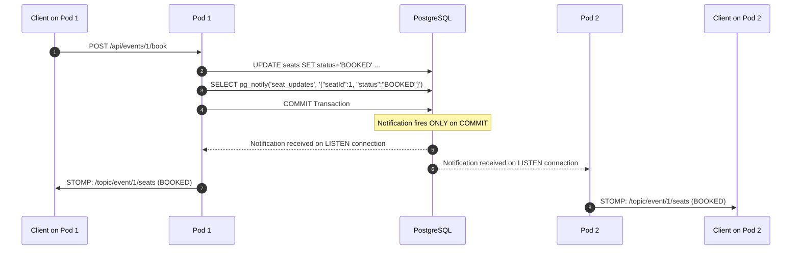
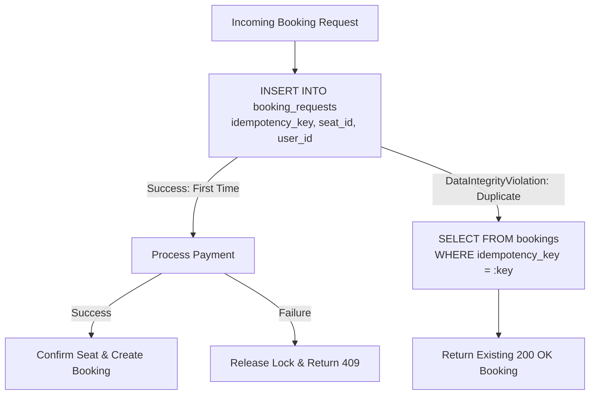

# SeatLock Architecture Deep Dive 📐

This document provides a comprehensive technical exploration of SeatLock's concurrency design, distributed synchronization, and failure mitigation strategies.

---

## 1. Concurrency Control Mechanisms

### 1.1 Pessimistic Locking with `FOR UPDATE SKIP LOCKED`

```sql
SELECT * FROM seats 
WHERE id = :seatId AND status = 'AVAILABLE' 
FOR UPDATE SKIP LOCKED;
```

#### How It Operates:
1. **Row-Level Lock Acquisition**: When a transaction executes this statement, PostgreSQL attempts to acquire an exclusive row lock (`RowExclusiveLock`) on the target row in the `seats` table.
2. **Instant Non-Blocking Skip**: If another active transaction already holds an exclusive lock on that row:
   - Regular `FOR UPDATE` would cause the query to **block** until the first transaction commits or rolls back (causing thread pool exhaustion under high concurrency).
   - `FOR UPDATE NOWAIT` would immediately throw a serialization error (`ERROR: could not obtain lock on row in relation "seats"`).
   - `FOR UPDATE SKIP LOCKED` ignores locked rows and immediately returns an empty result set (`0 rows`).
3. **Application Reaction**: The Spring Boot backend observes `Optional.empty()` and immediately responds with HTTP 409 Conflict without consuming database or thread resources.

```mermaid
sequenceDiagram
    autonumber
    actor UserA as User A (Pod 1)
    actor UserB as User B (Pod 2)
    participant DB as PostgreSQL (seats table)

    UserA->>DB: BEGIN TX 1
    UserB->>DB: BEGIN TX 2
    UserA->>DB: SELECT * FROM seats WHERE id=1 AND status='AVAILABLE' FOR UPDATE SKIP LOCKED
    DB-->>UserA: Returns Row (Seat 1 - Locked)
    UserB->>DB: SELECT * FROM seats WHERE id=1 AND status='AVAILABLE' FOR UPDATE SKIP LOCKED
    DB-->>UserB: Returns 0 Rows (Skipped!)
    UserB->>UserB: Return HTTP 409 Conflict immediately (0ms wait)
    UserA->>DB: UPDATE seats SET status='BOOKED' ...; COMMIT
```

---

### 1.2 Optimistic Locking with `@Version`

```java
@Version
@Column(nullable = false)
private Integer version;
```

#### How It Operates:
1. When a transaction reads the seat row, Hibernate retrieves the current `version` (e.g., `version = 0`).
2. When modifying the seat to `LOCKED`, Hibernate executes:
   ```sql
   UPDATE seats 
   SET status = 'LOCKED', version = 1, locked_by = :userId, updated_at = now() 
   WHERE id = :seatId AND version = 0;
   ```
3. If another transaction updated the seat in the interim (`version` is already `1`), the `UPDATE` matches `0 rows`.
4. Spring Data / Hibernate throws `ObjectOptimisticLockingFailureException`.
5. The service catches the exception and gracefully returns an empty result.

#### Comparative Benchmark Analysis:

| Dimension | Pessimistic (`FOR UPDATE SKIP LOCKED`) | Optimistic (`@Version`) |
|---|---|---|
| **Lock Duration** | Holds lock throughout transaction | No locks held until commit |
| **High Contention Behavior** | Deterministic: first thread locks, others skip | All threads proceed, only first to flush succeeds |
| **Database Overhead** | Minimal row lock tracking | Minimal version comparison |
| **Throughput under Low Contention** | Slightly lower (~650 TPS) | Higher (~1400 TPS) |
| **Ideal Scenario** | "Flash Sale" where 500 users fight for 1 seat | General booking across large catalog |

---

## 2. Distributed Synchronization Without Redis

### 2.1 Cross-Pod WebSocket Fan-Out via `LISTEN` / `NOTIFY`

In a multi-pod Kubernetes deployment (3 replicas), WebSocket connections are stateful and pinned to individual pods. When Pod 1 confirms a booking, Pods 2 and 3 must also notify their connected clients.



#### Implementation Highlights:
- **Transactional Guarantee**: `pg_notify` fires **strictly on transaction commit**. If the transaction rolls back, no notification is ever broadcasted.
- **Dedicated Unpooled Connection**: PostgreSQL `LISTEN` requires a persistent, long-lived TCP connection. HikariCP pool recycling would terminate the channel subscription. We use a dedicated `DriverManager.getConnection()` instance managed by Spring's `SmartLifecycle`.
- **Payload Discipline**: PostgreSQL payloads are capped at 8,000 bytes. SeatLock passes lightweight JSON event payloads containing only IDs and status strings.

---

### 2.2 Distributed Scheduled Jobs via `pg_try_advisory_xact_lock`

```sql
SELECT pg_try_advisory_xact_lock(1001);
```

#### Why Not Redis Distributed Lock (Redlock)?
- **Split-Brain Immunity**: Redlock across Redis nodes is vulnerable to clock drift and GC pauses. PostgreSQL advisory locks are managed by the single ACID database engine.
- **Transaction Scope (`_xact_`)**: The lock automatically releases the moment the transaction commits or aborts—even if the JVM crashes or the pod is killed.
- **Non-Blocking (`try_`)**: Returns `true` if acquired, `false` immediately if another pod is already running the job.

---

## 3. Idempotency Gate Architecture



- **Gate Mechanism**: PostgreSQL `UNIQUE (idempotency_key)` constraint.
- **No Check-Then-Act Race**: We do not check if a key exists before inserting. The insert **is** the atomic gate.

---

## 4. Local Test Environment Constraints (i5 / 16GB Laptop)

When profiling high-concurrency systems locally, hardware resource exhaustion can produce false-negative errors that mimic concurrency bugs:

- **Resource Distribution**: The laptop runs Minikube (4 CPUs, 6GB RAM), 3 Spring Boot JVMs, PostgreSQL, the React dev server, and the k6 load generator simultaneously on a single 4-core / 8-thread machine.
- **Local Target (300–500 VUs)**: This range tests real lock contention against 500 inventory items while leaving headroom for the host OS.
- **Distinguishing False Negatives from Application Bugs**: When CPU exceeds 95%, the OS kernel may drop TCP handshakes (`ECONNRESET` or socket timeout). Before assuming a locking bug, verify host saturation via `kubectl top pods` and `docker stats`. Any 2,000+ VU runs are reserved for the cloud environment (Oracle VM).

---

## 5. Deployment & Cost Reference Table

| Environment | Monthly Cost | Trade-Off Accepted | Role in Interview |
|---|---|---|---|
| **Minikube (Local)** | **$0** | No real network, runs on host | **PRIMARY DEMO** (always reliable, zero network dependency) |
| **Oracle VM + K3s (No LB)** | **$0** | No TLS, single node, manual IP | **CLOUD SCALE PROOF** (one-time deployment for 2,000+ VU run) |
| **Oracle VM + K3s + Cloud LB** | **~$20** | Stable endpoint, TLS, single-node | Optional production upgrade |
| **Managed DB Upgrade** | **~$45+** | Needed once traffic exceeds Neon free tier | Enterprise scale upgrade |

---

## 6. What Breaks at 10x Scale (50,000+ Users)?

| Component | Limit in Current Architecture | 10x Scale Evolution |
|---|---|---|
| **DB Connections** | Max connections hit during burst | Add **PgBouncer** connection pooler in transaction mode |
| **Cross-Pod Sync** | `pg_notify` payload capped at 8KB | Transition to **Apache Kafka** or **Redis Streams** |
| **Waiting Room Queue** | DB table polling for queue position | Use **Redis Sorted Sets (`ZADD` / `ZRANK`)** |
| **Seat Map Read Traffic** | Database queried for full map | Cache seat map in **Redis** with write-through cache |
