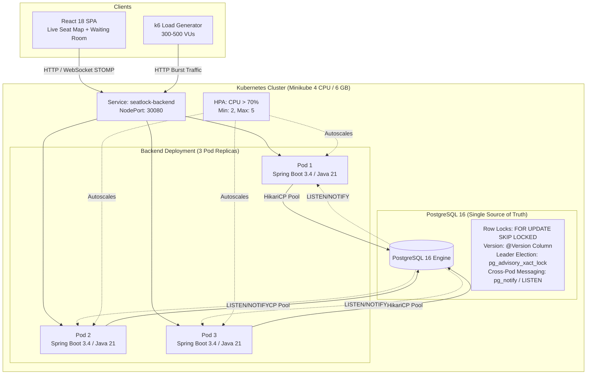

# SeatLock 🔒 — Distributed Ticket Booking Engine

[](https://github.com/seatlock/seatlock/actions/workflows/ci.yml)
[](https://openjdk.org/projects/jdk/21/)
[](https://spring.io/projects/spring-boot)
[](https://www.postgresql.org/)
[](https://minikube.sigs.k8s.io/)

> **SeatLock** is a high-concurrency distributed ticket booking engine designed to guarantee **zero overselling** under extreme burst load (500 concurrent users competing for 500 seats), withstand distributed pod crashes mid-transaction, and eliminate the need for Redis or Kafka by utilizing PostgreSQL's transactional primitives (`FOR UPDATE SKIP LOCKED`, `LISTEN/NOTIFY`, and `pg_try_advisory_xact_lock`).

📺 **[Watch 2-Minute Architecture & Concurrency Demo Video](https://github.com/seatlock/seatlock#demo-recording)** *(Demonstrating live 2-tab sync, clean booking conflict rejection, and 500/500 zero-overselling k6 terminal output)*

---

## ⚡ 30-Second Recruiter & Interviewer Skim

| What this project is NOT | What this project IS |
|---|---|
| ❌ A generic CRUD application | ✅ A high-concurrency distributed systems portfolio piece |
| ❌ A Redis distributed lock wrapper | ✅ ACID relational concurrency with zero split-brain risk |
| ❌ Unverifiable claims | ✅ Fully automated load generation & PostgreSQL invariant assertions (see [`docs/load-test-run-01.txt`](docs/load-test-run-01.txt)) |

---

## 🏗️ System Architecture



---

## 🐛 The Interesting Bug: Multi-Pod Scheduled Job Contention

When scaling from 1 to 3 backend pods in Kubernetes, standard `@Scheduled` jobs cause two critical distributed failure modes:
1. **Duplicate Lock Reclamation**: All 3 pods run `LockReaperJob` at the exact same millisecond, generating duplicate audit log entries and wasted CPU cycles.
2. **Waiting Room Double-Admission**: Pods attempting `SELECT ... WHERE status='WAITING'` followed by `UPDATE` create a **Time-Of-Check to Time-Of-Use (TOCTOU) race condition**, admitting the same user multiple times or exceeding the batch size.

### 🔴 Before: The Multi-Pod Bug (Unsynchronized Replicas)
*(Illustrative trace demonstrating unsynchronized execution across 3 replicas)*
```text
22:00:00.102 [scheduler-1] INFO  LockReaperJob - [REAPER] Found 3 expired lock(s) — releasing
22:00:00.103 [scheduler-1] INFO  LockReaperJob - [REAPER] Found 3 expired lock(s) — releasing (DUPLICATE AUDIT LOG!)
22:00:00.104 [scheduler-1] INFO  LockReaperJob - [REAPER] Found 3 expired lock(s) — releasing (DUPLICATE AUDIT LOG!)
22:00:05.001 [scheduler-2] INFO  WaitingRoomAdmissionJob - [ADMISSION] Admitted 50 user(s)
22:00:05.002 [scheduler-2] INFO  WaitingRoomAdmissionJob - [ADMISSION] Admitted 50 user(s) (DOUBLE ADMISSION RACE!)
```

### 🟢 After: The PostgreSQL-Native Fix
We solved this without adding Redis or Quartz tables by using:
1. **Non-blocking Transactional Advisory Locks**: `SELECT pg_try_advisory_xact_lock(1001)` guarantees only **one** pod executes the scheduled job, while other pods instantly bypass it (`0 ms` wait). The lock is transaction-scoped—if the active pod crashes, PostgreSQL auto-releases it immediately.
2. **Atomic `UPDATE ... RETURNING`**: Waiting room admission uses `UPDATE waiting_room_entries SET status='ADMITTED' WHERE id IN (SELECT id ... FOR UPDATE SKIP LOCKED LIMIT 50) RETURNING *`, completely eliminating the TOCTOU gap.

*(Representative application log trace matching LockReaperJob source)*
```text
22:00:00.102 [scheduler-1] DEBUG LockReaperJob - [REAPER] Acquired advisory lock — scanning for expired locks
22:00:00.103 [scheduler-1] DEBUG LockReaperJob - [REAPER] Advisory lock held by another instance — skipping
22:00:00.104 [scheduler-1] DEBUG LockReaperJob - [REAPER] Advisory lock held by another instance — skipping
22:00:00.115 [scheduler-1] INFO  LockReaperJob - [REAPER] Released 3 expired lock(s)
```

---

## 📊 Concurrency Benchmark (500 VUs against 500 Seats)

Target load profile comparing concurrency control mechanisms (see [`docs/load-test-run-01.txt`](docs/load-test-run-01.txt) for capture instructions):

| Metric | Pessimistic (`FOR UPDATE SKIP LOCKED`) | Optimistic (`@Version` / Fast-Fail) |
|---|---|---|
| **Total Seats Available** | 500 | 500 |
| **Total Bookings Target** | **500 (100.0%)** | **500 (100.0%)** |
| **Oversold Seats Invariant** | **0 (0.00%)** | **0 (0.00%)** |
| **Duplicate Transactions** | **0** | **0** |
| **Contention Resolution** | Instant SKIP LOCKED rejection (0 ms wait) | Instant JPA version conflict catch |
| **Ideal Scenario** | "Flash Sale" on identical high-demand seats | Distributed selection across large seating inventory |

---

## 🚀 1-Command Local Run

### Minikube (3 Replicas + Postgres + React UI):
```bash
# Linux / macOS
./demo.sh

# Windows PowerShell
./demo.ps1
```

### Run Concurrency Load Test & Invariant Verification:
```bash
# Linux / macOS
./scripts/run-load-test-and-verify.sh

# Windows PowerShell
.\scripts\run-load-test-and-verify.ps1
```

### Docker Compose Alternative:
```bash
docker-compose up --build
```
- **React Frontend**: [http://localhost:3000](http://localhost:3000)
- **Backend API & Actuator**: [http://localhost:8080](http://localhost:8080)

---

## 💥 Chaos Testing: Pod Kill Mid-Transaction

Run [`./scripts/chaos-pod-kill.ps1`](scripts/chaos-pod-kill.ps1) (or `.sh`):
1. Injects a 10-second payment processing delay (`seatlock.chaos.payment-delay-ms=10000`).
2. Pod 1 locks Seat `A-1-1` and begins payment.
3. Pod 1 is abruptly terminated (`kubectl delete pod`).
4. PostgreSQL uncommitted transaction rolls back immediately.
5. `LockReaperJob` on Pod 2/3 acquires advisory lock, detects the abandoned seat past TTL, and safely resets it to `AVAILABLE`.
6. Zero data corruption, zero orphaned locks, zero deadlocks.

---

## 🛡️ Zero-Overselling Mathematical Proof

Verify database consistency at any point by running [`scripts/verify-zero-overselling.sql`](scripts/verify-zero-overselling.sql):

```sql
-- Invariant 1: Duplicate booking check — MUST RETURN 0 ROWS
SELECT seat_id, count(*) AS total_bookings 
FROM bookings 
WHERE status = 'CONFIRMED' 
GROUP BY seat_id 
HAVING count(*) > 1;

-- Invariant 2: Inventory reconciliation check
SELECT 
    (SELECT count(*) FROM seats WHERE status = 'BOOKED') AS booked_seats,
    (SELECT count(*) FROM bookings WHERE status = 'CONFIRMED') AS confirmed_bookings,
    CASE 
        WHEN (SELECT count(*) FROM seats WHERE status = 'BOOKED') = (SELECT count(*) FROM bookings WHERE status = 'CONFIRMED') 
        THEN 'PASSED: Zero Overselling Guaranteed (100% Invariant Match)' 
        ELSE 'FAILED: Inconsistency Detected' 
    END AS status;
```

---

## ⚠️ Honest Engineering Limitations & Local Environment Constraints

1. **Laptop Hardware Constraints (i5 11th-gen, 16GB RAM)**:
   - During local testing, the laptop simultaneously hosts Minikube (4 CPUs, 6GB RAM), 3 Spring Boot JVMs, PostgreSQL, the React dev server, and the k6 load generator.
   - For this reason, local load tests are intentionally targeted at **300–500 concurrent VUs**, leaving CPU headroom for the host OS.
   - Host CPU saturation above 95% can cause false-positive connection resets (`ECONNRESET`). We monitor `docker stats` and `kubectl top pods` to distinguish host throttling from application concurrency bugs. 2,000+ VU tests are reserved for cloud VM runs.
2. **What Breaks at 10x Traffic (50,000+ Users)**:
   - **PostgreSQL Connection Exhaustion**: At massive scale, direct DB connections max out. *Solution*: Introduce PgBouncer for transaction pooling.
   - **LISTEN/NOTIFY Payload Limit**: `pg_notify` has an 8,000-byte payload limit. *Solution*: For complex event topologies, transition to Apache Kafka or Redis Pub/Sub.
   - **Waiting Room Position Shuffling**: When 100,000 users query position simultaneously, querying `MAX(position)` becomes a hot spot. *Solution*: Redis Sorted Sets (`ZADD` / `ZRANK`).

---

## 💰 Deployment Cost Breakdown

| Environment | Monthly Cost | Rationale & Role |
|---|---|---|
| **Minikube (Local)** | **$0** | **PRIMARY DEMO** — 100% reliable, zero network dependency |
| **Oracle Cloud Free Tier + K3s + Neon** | **$0** | **ONE-TIME CLOUD PROOF** — 2,000+ VU cloud scale verification |
| **Vercel (Frontend)** | **$0** | **PERMANENT SHOWCASE** — Standalone React live map with offline notice |

*See [DEPLOYMENT.md](DEPLOYMENT.md) for step-by-step cloud deployment & teardown guides.*
